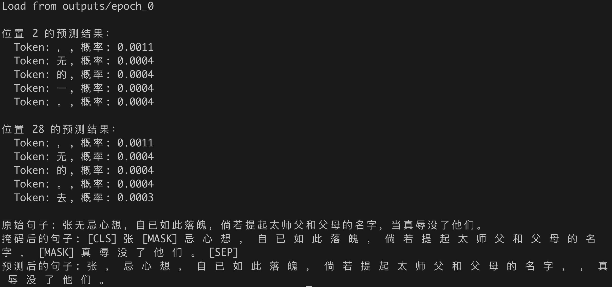
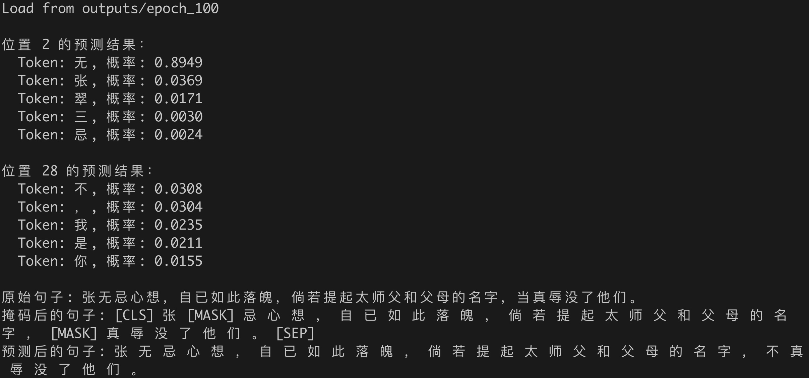
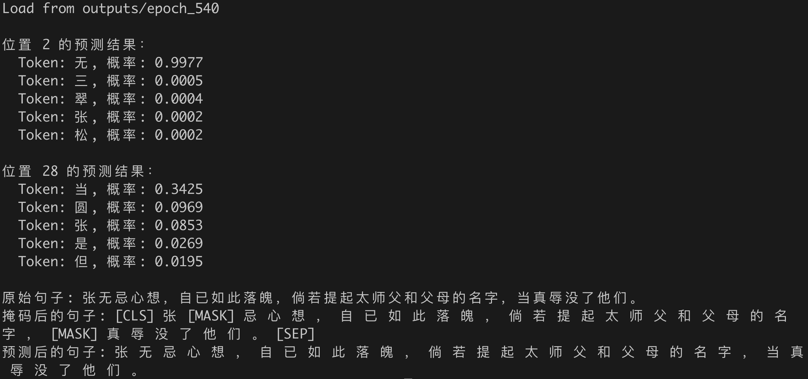

# BERT on 《倚天屠龙记》

## Results
<div style="display:flex; justify-content:space-between;">
  
  
  
</div>

## Download
Only codes.
```bash
git clone https://github.com/Cliffest/BERT.git
```

Codes and model weights (require Git LFS).
```bash
git lfs clone https://github.com/Cliffest/BERT.git
```

## Requirements
```bash
# conda env export > environment.yml
conda env update -n bert -f environment.yml
conda activate bert
```

## Train
Train model on single GPU (default).
```bash
python train.py --data_path data/倚天屠龙记_train_no-space.txt --output_dir outputs --batch_size 32
python train.py --data_path data/倚天屠龙记_train_no-space.txt --output_dir outputs --batch_size 32 --epochs 1000 --resume_from_epoch 10 --save_interval 10
```

Train model on CPU.
```bash
python train.py --mode CPU --data_path data/倚天屠龙记_train_no-space.txt --output_dir outputs --batch_size 32
```

DataParallel (DP) train model with multi-GPU on single machine.
```bash
CUDA_VISIBLE_DEVICES=0,1 python train.py --mode DP --data_path data/倚天屠龙记_train_no-space.txt --output_dir outputs --batch_size 64
```

DistributedDataParallel (DDP) train model with multi-GPU on single machine.
```bash
CUDA_VISIBLE_DEVICES=0,1 torchrun --nproc-per-node=2 --nnodes=1 --node_rank=0 --master_addr=127.0.0.1 --master_port=12121 train.py --mode DDP --data_path data/倚天屠龙记_train_no-space.txt --output_dir outputs --batch_size 32
```

DistributedDataParallel (DDP) train model on multi-machines.
```bash
# Machine 0 (main node)
torchrun --nproc-per-node=2 --nnodes=2 --node_rank=0 --master_addr="IP of main node" --master_port=12121 train.py --data_path data/倚天屠龙记_train_no-space.txt --output_dir outputs --batch_size 64
# Machine 1
torchrun --nproc-per-node=2 --nnodes=2 --node_rank=1 --master_addr="IP of main node" --master_port=12121 train.py --data_path data/倚天屠龙记_train_no-space.txt --output_dir outputs --batch_size 64
```

Save model at epoch $N$.
```bash
python train.py --data_path data/倚天屠龙记_train_no-space.txt --output_dir outputs --epochs N --resume_from_epoch N
```

## Test
```bash
python test.py --model_dir outputs --n_epoch 10 --mask_token_ids 3
```

For example, commands to run the model that has been trained for 3280 epochs.
```bash
# Get model files from checkpoint_epoch_3280.pth
python train.py --data_path data/倚天屠龙记_train_no-space.txt --output_dir outputs --epochs 3280 --resume_from_epoch 3280
# Test instance
python test.py --model_dir outputs --n_epoch 3280 --mask_token_ids 3 28
```